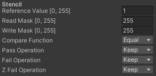

# Portal Room

Use case of the stencil buffer.

<p align="center"></p>

The scene contains 4 different objects inside a room and each one of them is only visible from one side.

The stencil buffer is an extra data buffer that stores an integer per pixel, usually 1 byte. The most common uses of the stencil buffer are outline geometry, planar reflections or portal rendering. The stencil buffer parameters are exposed as shader properties.
```
Stencil
{
	Ref [_StencilRef]
	ReadMask [_StencilReadMask]
	WriteMask [_StencilWriteMask]
	Comp [_StencilComp]
	Pass [_StencilPass] 
	Fail [_StencilFail]
	ZFail [_StencilZFail]
}
```

<ul>
	<li><strong>_StencilRef</strong>. Value to be written to the buffer or the value to be compared against.</li>
	<li><strong>_StencilReadMask</strong>. 8-bit mask used when comparing the reference value with the contents of the buffer.</li>
	<li><strong>_StencilWriteMask</strong>. 8-bit mask used when writing to the buffer.</li>
	<li><strong>_StencilComp</strong>. Function used to compare the reference value to the current contents of the buffer.</li>
	<li><strong>_StencilPass</strong>. Opperation to do with the contents of the buffer if the stencil test (and the depth test) passes.</li>
	<li><strong>_StencilFail</strong>. Opperation to do with the contents of the buffer if the stencil test fails.</li>
	<li><strong>_StencilZFail</strong>. Opperation to do with the contents of the buffer if the stencil test passes, but the depth test fails.</li>
</ul>

Each plane has its own material where the stencil buffer is filled with an integer from 1 to 4.

<p align="center"></p>

Similarly, each gameobject has a material that only draws the object if the stencil buffer has a specific value from 1 to 4.

<p align="center"></p>

References.
> <a href="https://docs.unity3d.com/Manual/SL-Stencil.html">Stencil Buffer Documentation</a>
